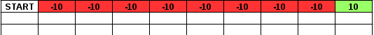
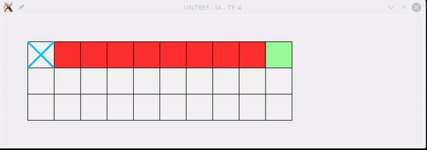
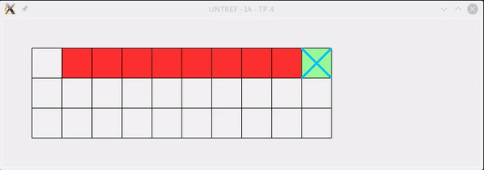

UNTREF - Inteligencia Artificial - TP 4: Reinforcement Learning
===============================================================

Objetivo: Descubrir las diferencias entre **Q-Learning** y **SARSA** mediante un juego con las siguientes caracterísiticas.

* Es un tablero de 3 x 10
* Se comienza en la posición (0,0)
* Las posiciones entre (0,1) y (0,9) restan 10 puntos y finalizan la partida (celdas rojas).
* La posición (0,10) suma 10 puntos y finaliza la partida (celda verde).
* Las demás posiciones no suman ni restan puntos.
* Los movimientos posibles son __ARRIBA__, __IZQUIERDA__, __DERECHA__ Y __ABAJO__.
* Al realizarse un movimiento, hay un 80% de probabilidad de ir en la dirección deseada, un 0% de ir en la contraria, y un 10% de ir en cada una de las otras 2 direcciones.

__Diagrama__ :


__Solución__ :
Se implementó un programa en python, el cual puede entrenar (y guardar el modelo entrenado) ya sea utilizando __Q-Learning__ como __SARSA__ o jugar una partida con el modelo ya entrenado usando alguno de los métodos antes mencionados.

# Partidas:

Con una X se muestra la posición actual.

Ejemplo de partida con __Q-Learning__ :
``` python
> python reinforcement_learning.py play_q
> Selected Option:  play_q
> # of Moves:  13
> score:  10
```


Ejemplo de partida con __SARSA__ :
``` python
> python reinforcement_learning.py play_s
> Selected Option:  play_s
> # of Moves:  17
> score:  10
```


# Diferencias:
Como se puede observar __SARSA__ es mucho mas conservador que __Q-Learning__, ya que intenta ir hacia lo mas abajo posible, para evitar caer en las celdas rojas, en cambio __Q-Learning__ intenta tomar el camino más rápido hacia la meta.